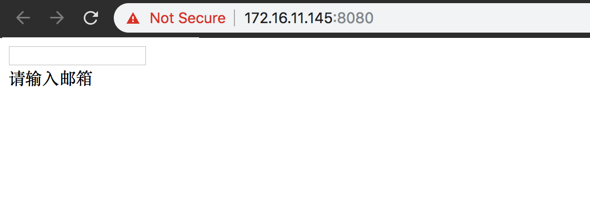

# 如何使用 vee-validate 自定义错误提示

VeeValidate 插件自带错误提示语言，但在实际的开发场景中我们常常需要对提示语言进行自定义。

## 版本

- Vue `2.5.22`
- vue-validate `2.1.7`

## 编写 DemoForm.vue

```vue
<template>
  <div>
    <div>
      <input
        type="text"
        v-validate="{ required: true, email: true }"
        data-vv-as="邮箱"
        name="email"
      />
    </div>
    <div>
      <span>{{ errors.first("email") }}</span>
    </div>
  </div>
</template>
<script>
import Vue from "vue";
import VeeValidate, { Validator } from "vee-validate";
import zh_CN from "vee-validate/dist/locale/zh_CN";

Vue.use(VeeValidate);
Validator.localize("zh_CN", zh_CN);

/** custom message */
const required = (field) => `请输入${field}`;
const email = "邮箱格式有误";
const messages = {
  required,
  email,
};

/** custom dictionary */
const dictionary = {
  zh_CN: {
    messages,
  },
};

Validator.localize(dictionary);
export default {
  name: "DemoForm",
};
</script>
```

- 通过 data-vv-as 指令标示当前字段的语言名称，比如 email 字段的简体中文名称是邮箱

- 除了 import 基本的 VeeValidate 外，还需要导入 Validator 用于配置语言

- 导入对应的语言文件，这里以简体中文为例是 `zh_CN`

- 使用 `Validator.localize()` 设定为 `zh_CN`

- 将自定义信息定义在 dictionary，其中第一层是语言，比如：`zh_CN` `zh_TW`等；第二层定义语言对象

- VeeValidate 規定自定义信息对象每个属性的值可以是`function`或`string`。若为 function，则第一个参数为字段的 name 值；若为 string，则可以直接赋值

- 最后再将定义好的对象 `dictionary` 传入 `Validator.localize()`

## 验证

- 不允许为空的自定义提示
  

- 邮箱地址不合法的自定义提示
  

## 参考地址

- [如何使用 VeeValidate 顯示自訂訊息 ?](https://oomusou.io/vue/vee-validate/custom-message/)
- [VeeValidate Docs](https://baianat.github.io/vee-validate/)
- [Error Messages](https://baianat.github.io/vee-validate/guide/messages.html)
