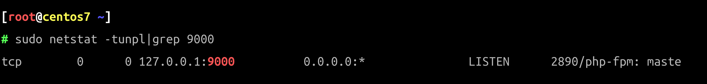

# CentOS 7 LNMP 安装和配置

## 软件版本

* CentOS Linux release 7.9.2009 (Core)
* nginx 1.20.1
* MySQL 5.7.38
* php-fpm 8.1.6
* Composer 1.4.2
* Laravel 9.12.2
* nodejs v16.15.0 && npm 8.5.5 && yarn 1.22.18

## 升级 EPEL 仓库

### 升级命令

EPEL \(Extra Packages for Enterprise Linux，企业版Linux的额外软件包\)
是Fedora小组维护的一个软件仓库项目，为RHEL/CentOS提供他们默认不提供的软件包。这个源兼容RHEL及像CentOS和Scientific Linux这样的衍生版本。

更多详细介绍查看这里：[EPEl](https://fedoraproject.org/wiki/EPEL "EPEL Repository")

我们需要Nginx安装的EPEL仓库，因为官方CentOS仓库中不存在Nginx软件包。

```bash
sudo yum -y install epel-release
```

运行完成上面的`yum`命令安装`EPEL`仓库。

### 检查升级结果

```bash
sudo yum repolist
```


## 安装Nginx

使用LNMP环境下运行Laravel。Nginx是其中的Web服务器部分，可以从EPEL仓库安装。

```bash
sudo yum -y install nginx
```

### 启动Nginx

安装完成后，启动 Nginx 并将其添加到系统自启动。

```bash
sudo systemctl start nginx
sudo systemctl enable nginx
```

### 检查Nginx

Nginx默认运行在 80 端口，使用下面的`netstat`命令检查。

```bash
netstat -plntu | grep 80
```


至此`Nginx`安装完毕。

## 安装PHP

在CentOS基础库中不存在PHP 8.1，我们需要从`remi`的第三方仓库中安装它。


> 之所以推荐它是因为它非常方便切换PHP的版本。

更多仓库相关信息[参考这里](https://rpms.remirepo.net/)。

### 安装

```bash
yum -y install https://mirrors.aliyun.com/remi/enterprise/remi-release-7.rpm # 从阿里云镜像处安装remi源
yum repolist all |grep php # 检查当前yum允许安装的PHP版本
sudo yum-config-manager --enable remi-php81 # 默认remi仓库禁用的，实际使用时启用
sudo yum install -y php81 php81-php-fpm php81-php-gd php81-php-mbstring php81-php-mysqlnd php81-php-xml php81-php-opcache php81-php-pecl-zip php81-php-bcmath
# sudo mkdir -p /run/php-fpm/remi-php81 # 创建一个sock存放的目录
sudo ln -s  `which php81` /usr/bin/php # 建立软连接方便命令行使用
```

执行完上面的命令后，CentOS系统上已经安装了PHP 8.1, 安装好的`php81`目录在`/etc/opt/remi/php81`。

### 卸载

```bash
sudo yum-config-manager --disable remi-php81 # 禁用remi-php81仓库
sudo systemctl stop php81-php-fpm.service
yum remove php81 php81-php-fpm php81-php-gd php81-php-mbstring php81-php-mysqlnd php81-php-xml php81-php-opcache php81-php-pecl-zip php81-php-bcmath
sudo rm -rf /etc/opt/remi/remi-php81 # 删除前记得备份配置
```

至此，使用remi仓库安装的PHP已经成功卸载。

### 多版本安装

再安装一个PHP 8.0 版本为例，执行下面的操作即可完成PHP8.0版本的安装，文件安装在 `/ect/opt/remi/php80`目录下。

```bash
sudo yum-config-manager --enable remi-php80
sudo yum install php80 php80-php-fpm php80-php-gd php80-php-mbstring php80-php-mysqlnd php80-php-xml php80-php-opcache php80-php-pecl-zip php80-php-bcmath
# sudo mkdir -p /run/php-fpm/remi-php80 # 创建一个sock存放的目录
# sudo ln -s  `which php80` /usr/local/sbin/php # 建立软连接方便命令行使用
```

### 配置php-fpm

通过使用 vim 编辑配置文件`php.ini`来配置PHP，PHP8.1的主配置文件存放位置在`/etc/opt/remi/php81/php.ini`。

* 在文件中找如如下行，取消它的行注释并将值更改为0。

```ini
cgi.fix_pathinfo = 0
```

保存文件并退出编辑器。

编辑`php-fpm`文件`www.conf`，PHP8.1的主配置文件存放位置在`/etc/opt/remi/php81/php-fpm.d/www.conf`。

* `php-fpm`将在用户和组`nginx`下运行，将下面两行的值更改为`nginx`，这里用户和用户组请保持与`Nginx`的用户和用户组一致。

```ini
# 用户和组保持和Nginx一致，使用命令 egrep '^(user|group)' /etc/nginx/nginx.conf 查看nginx进程的用户
user = nginx
group = nginx
```

* `php-fpm`将在套接字文件下运行，而不是使用服务器端口，**remi仓库**方式安装的PHP可以将值改为`/run/php-fpm/remi-php81/php-fpm.sock`，**webtatic仓库**
  方式安装的PHP请将'listen'值更改为路径`/run/php-fpm/php-fpm.sock`。

```ini
listen = 127.0.0.1:9000 # 如果多版本的话，设置不同的监听端口，或者配置不同的socket文件的方式
# listen = /var/run/php/php8.1-fpm.sock
```

* 套接字文件所有者将是“nginx”用户，权限模式为660，取消注释并更改所有值。

```ini
listen.owner = nginx
listen.group = nginx
listen.mode = 0660
```

* 对于环境变量，取消注释这些行并设置值。

```ini
env[HOSTNAME] = $HOSTNAME
env[PATH] = /usr/local/bin:/usr/bin:/bin
env[TMP] = /tmp
env[TMPDIR] = /tmp
env[TEMP] = /tmp
```

保存文件并退出vim编辑，然后启动`php-fpm`并使其在启动时运行。

```bash
sudo systemctl start php81-php-fpm.service # 启动PHP8.1
sudo systemctl enable php81-php-fpm.service # 开机自启动PHP8.1
```

## 检查php-fpm

检查端口是否正常打开运行：

```bash
sudo netstat -tunpl|grep 9000 
# sudo netstat -pl | grep php-fpm.sock # 或者查看socket文件
```



至此，php-fpm 进程已经启动。

## 安装MySQL

可以使用MariaDB或PostgreSQL作为Laravel项目的数据库存储。

这里使用MySQL数据库服务器进行安装。它在CentOS存储库中可用，使用下面的`yum`
命令[安装MySQL-server](https://dev.mysql.com/doc/mysql-yum-repo-quick-guide/en/ "mysql server install")。

### 下载并安装MySQL5.7

```bash
wget https://dev.mysql.com/get/mysql57-community-release-el7-11.noarch.rpm # 安装MySQL5.7
# wget https://dev.mysql.com/get/mysql80-community-release-el7-5.noarch.rpm # 安装MySQL8.0
yum localinstall mysql57-community-release-el7-11.noarch.rpm -y
yum repolist enabled | grep "mysql.-community." # 检查是否安装成功
sudo yum install -y mysql-server
```

> 执行上面的命令进行MySQL的安装，在安装的过程中两次按`Y`键，在同意后安装完成。

### 启动MySQL

使用下面的命令启动`mysql`并使其随系统启动而启动。

```bash
sudo systemctl start mysqld
sudo systemctl enable mysqld
```

### 配置MySQL

#### 获取安装时初始化密码

```bash
sudo grep 'temporary password' /var/log/mysqld.log
```

#### 登录并重设root账户密码

```bash
mysql -uroot -p # 回车输入上面获取到的一次性密码

ALTER USER 'root'@'localhost' IDENTIFIED BY 'MyNewPassword1!';
```


#### 创建一个测试数据库和测试用户

```
CREATE DATABASE laravel; -- 创建一个laravel数据库
GRANT ALL PRIVILEGES ON laravel.* TO laravel@localhost IDENTIFIED BY "LaravelPassword1!"; -- 创建一个对应的用户
```

### 测试MySQL

MySQL已经启动并在3306端口上运行，可以使用netstat命令检查。

```bash
netstat -plntu | grep 3306 # 检查端口
ps aux|grep mysqld # 检查进程
```


至此，MySQL的安装和配置已经完成。


## 安装PHP Composer

PHP composer是PHP语言的包管理器。 它创建于2011年，灵感来自于Node.js的“npm”和Ruby的“bundler”安装程序。 使用`curl`命令安装composer。

```bash
php -r "copy('https://install.phpcomposer.com/installer', 'composer-setup.php');"
php composer-setup.php
php -r "unlink('composer-setup.php');"
sudo mv composer.phar /usr/local/bin/composer
```

* 配置Packagist国内镜像

```bash
composer config -g repo.packagist composer https://mirrors.aliyun.com/composer
```

安装完成后，尝试使用“composer”命令，您将看到以下结果。

```bash
composer -V # 查看composer版本
composer config -g repo.packagist -l # 查看配置的Packagist国内镜像
```

至此，Composer已经正常安装在了CentOS系统上。

### NodeJS && NPM

```bash
sudo yum -y install nodejs npm --enablerepo=epel
```

### Yarn

```bash
sudo npm install -g yarn
```

### 安装Laravel测试LNMP

现在进入到 laravel 的根目录`/var/www/codes/laravel.domain.io`。

```bash
sudo mkdir -p /var/www/codes/laravel.domain.io && cd /var/www/codes/laravel.domain.io
```

Laravel提供了两种在服务器上[安装框架](https://laravel.com/docs/5.4/installation "Install Laravel Framework Document")
的方法。
通过使用composer命令创建一个新项目来安装Laravel，运行下面的命令来安装Laravel。

```bash
composer create-project laravel/laravel .
```

等待Laravel安装完成，这可能需要一些时间。

安装完成后，将Laravel Web服务器录的所有者更改为“nginx”用户，并使用以下命令将存储目录的权限更改为755。

```bash
chown -R nginx:root /var/www/codes/laravel.domain.io
chmod 755 -R /var/www/codes/laravel.domain.io/storage
```

至此，Laravel安装已经完成。

### 为 Laravel 配置Nginx配置

在这个步骤中，将为 Laravel 项目创建 Nginx 虚拟主机配置。 我们需要为此 Laravel 定义web根目录`/var/www/codes/laravel.domain.io/public`。

接下来，`cd`到 Nginx 目录，并在`conf.d`目录中创建一个新的虚拟主机配置文件`laravel.domain.io.conf`

```bash
echo '
server {
    listen 80;

    # Log files for Debugging
    access_log /var/log/nginx/laravel.domain.io-access.log;
    error_log /var/log/nginx/laravel.domain.io-error.log;

    # Webroot Directory for Laravel project
    root /var/www/codes/laravel.domain.io/public;
    index index.php index.html index.htm;

    # Your Domain Name
    server_name laravel.domain.io;

    location / {
        try_files $uri $uri/ /index.php?$query_string;
    }

    # PHP-FPM Configuration Nginx
    location ~ \.php$ {
        try_files $uri =404;
        fastcgi_split_path_info ^(.+\.php)(/.+)$;
        fastcgi_pass 127.0.0.1:9000;
        fastcgi_index index.php;
        fastcgi_param SCRIPT_FILENAME $document_root$fastcgi_script_name;
        include fastcgi_params;
    }

    location ~ /\.ht {
        deny all;
    }
}
' >> /etc/nginx/conf.d/laravel.domain.io.conf
```

### 测试并重启Nginx

测试nginx配置，确保没有错误，然后重新启动nginx服务。

```bash
nginx -t && sudo systemctl restart nginx # 检测配置文件，如果成功则重启Nginx
```

至此，Laravel的nginx虚拟主机配置已经完成。

### 测试Laravel

打开浏览器并输入服务器配置的Laravel URL，在Nginx虚拟主机文件中定义了Laravel的域名。 我的是`laravel.domain.io`。

访问域名时，您将看到Laravel框架的首页。


CentOS 7上的Nginx、PHP-FPM、MySQL、Composer、NodeJS、Yarn和Laravel安装已经成功。

## 参考连接

* [How to Install PHP 7 in CentOS 7](https://www.tecmint.com/install-php-7-in-centos-7/)

* [Install PHP 7 on CentOS 7](https://linuxize.com/post/install-php-7-on-centos-7/)

* [How To Install Node.js on a CentOS 7 server](https://www.digitalocean.com/community/tutorials/how-to-install-node-js-on-a-centos-7-server)

* [Centos7 安装Nodejs](https://www.jianshu.com/p/7d3f3fa056e8)
