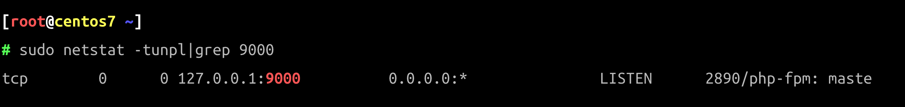

# 使用yum方式安装PHP

在CentOS基础库中不存在PHP 8.1，我们需要从`remi`的第三方仓库中安装它。


> 之所以推荐它是因为它非常方便切换PHP的版本。

更多仓库相关信息[参考这里](https://rpms.remirepo.net/)。

### 安装

```bash
yum -y install https://mirrors.aliyun.com/remi/enterprise/remi-release-7.rpm # 从阿里云镜像处安装remi源
yum repolist all |grep php # 检查当前yum允许安装的PHP版本
sudo yum-config-manager --enable remi-php81 # 默认remi仓库禁用的，实际使用时启用
sudo yum install -y php81 php81-php-fpm php81-php-gd php81-php-mbstring php81-php-mysqlnd php81-php-xml php81-php-opcache php81-php-pecl-zip php81-php-bcmath
# sudo mkdir -p /run/php-fpm/remi-php81 # 创建一个sock存放的目录
sudo ln -s  `which php81` /usr/bin/php # 建立软连接方便命令行使用
```

执行完上面的命令后，CentOS系统上已经安装了PHP 8.1, 安装好的`php81`目录在`/etc/opt/remi/php81`。

### 卸载

```bash
sudo yum-config-manager --disable remi-php81 # 禁用remi-php81仓库
sudo systemctl stop php81-php-fpm.service
yum remove php81 php81-php-fpm php81-php-gd php81-php-mbstring php81-php-mysqlnd php81-php-xml php81-php-opcache php81-php-pecl-zip php81-php-bcmath
sudo rm -rf /etc/opt/remi/remi-php81 # 删除前记得备份配置
```

至此，使用remi仓库安装的PHP已经成功卸载。

### 多版本安装

再安装一个PHP 8.0 版本为例，执行下面的操作即可完成PHP8.0版本的安装，文件安装在 `/ect/opt/remi/php80`目录下。

```bash
sudo yum-config-manager --enable remi-php80
sudo yum install php80 php80-php-fpm php80-php-gd php80-php-mbstring php80-php-mysqlnd php80-php-xml php80-php-opcache php80-php-pecl-zip php80-php-bcmath
# sudo mkdir -p /run/php-fpm/remi-php80 # 创建一个sock存放的目录
# sudo ln -s  `which php80` /usr/local/sbin/php # 建立软连接方便命令行使用
```

### 配置php-fpm

通过使用 vim 编辑配置文件`php.ini`来配置PHP，PHP8.1的主配置文件存放位置在`/etc/opt/remi/php81/php.ini`。

* 在文件中找如如下行，取消它的行注释并将值更改为0。

```ini
cgi.fix_pathinfo = 0
```

保存文件并退出编辑器。

编辑`php-fpm`文件`www.conf`，PHP8.1的主配置文件存放位置在`/etc/opt/remi/php81/php-fpm.d/www.conf`。

* `php-fpm`将在用户和组`nginx`下运行，将下面两行的值更改为`nginx`，这里用户和用户组请保持与`Nginx`的用户和用户组一致。

```ini
# 用户和组保持和Nginx一致，使用命令 egrep '^(user|group)' /etc/nginx/nginx.conf 查看nginx进程的用户
user = nginx
group = nginx
```

* `php-fpm`将在套接字文件下运行，而不是使用服务器端口，**remi仓库**方式安装的PHP可以将值改为`/run/php-fpm/remi-php81/php-fpm.sock`，**webtatic仓库**
  方式安装的PHP请将'listen'值更改为路径`/run/php-fpm/php-fpm.sock`。

```ini
listen = 127.0.0.1:9000 # 如果多版本的话，设置不同的监听端口，或者配置不同的socket文件的方式
# listen = /var/run/php/php8.1-fpm.sock
```

* 套接字文件所有者将是“nginx”用户，权限模式为660，取消注释并更改所有值。

```ini
listen.owner = nginx
listen.group = nginx
listen.mode = 0660
```

* 对于环境变量，取消注释这些行并设置值。

```ini
env[HOSTNAME] = $HOSTNAME
env[PATH] = /usr/local/bin:/usr/bin:/bin
env[TMP] = /tmp
env[TMPDIR] = /tmp
env[TEMP] = /tmp
```

保存文件并退出vim编辑，然后启动`php-fpm`并使其在启动时运行。

```bash
sudo systemctl start php81-php-fpm.service # 启动PHP8.1
sudo systemctl enable php81-php-fpm.service # 开机自启动PHP8.1
```

## 检查php-fpm

检查端口是否正常打开运行：

```bash
sudo netstat -tunpl|grep 9000 
# sudo netstat -pl | grep php-fpm.sock # 或者查看socket文件
```



至此，php-fpm 进程已经启动。
