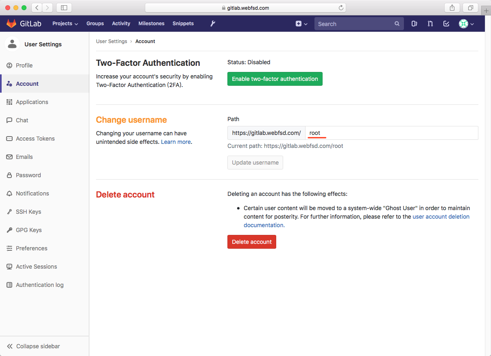

# 如何在CentOS 7上安装和配置GitLab CE

GitLab是一个基于GitLab Inc.开发的Rails的开源资源库管理器。它是一个基于Web的git资源库管理器，可让您的团队在编码，测试和部署应用程序方面进行协作。GitLab提供了多种功能，包括维基，问题跟踪，代码评论和活动提要。

### 步骤

* 配置服务器yum镜像（可选）
* 安装软件包
* 安装GitLab
* 配置GitLab URL
* 生成SSL让我们加密和DHPARAM证书
* 为GitLab启用Nginx HTTPS
* 配置firewalld
* 执行GitLab安装
* 测试

### 先决条件

* CentOS 7服务器 - 64位（CentOS 7.4 - 64位）
* 服务器RAM >= 4GB（RAM = 4GB）
* 服务器的ROOT特权（YES）
* 一个指向服务器的域名（gitlab.webfsd.com）

## 配置yum镜像

1. 备份

```bash
mv /etc/yum.repos.d/CentOS-Base.repo /etc/yum.repos.d/CentOS-Base.repo.backup
```

2. 下载

```bash
wget -O /etc/yum.repos.d/CentOS-Base.repo http://mirrors.aliyun.com/repo/Centos-7.repo
# 或者
curl -o /etc/yum.repos.d/CentOS-Base.repo http://mirrors.aliyun.com/repo/Centos-7.repo
```

3. 生成缓存

```bash
yum makecache
```

更多的阿里云镜像[查看这里](https://opsx.alibaba.com/mirror)。

## 安装软件包

在这一步中，我们将下载/安装GitLab安装所需的一些软件包。我们将使用curl下载版本库安装程序，SELinux管理器的policycoreutils，OpenSSH和postfix作为本地SMTP服务器。

```bash
sudo yum -y install curl policycoreutils openssh-server openssh-client postfix
```

之后，启动ssh和postfix服务。

```bash
systemctl start sshd
systemctl enable sshd

systemctl start postfix
systemctl enable postfix
```

经过上次的操作，所有GitLab安装所需的软件包现在都安装在服务器上

## 安装GitLab

GitLab提供了一个用于添加GitLab CE仓库的安装程序。使用curl下载安装程序并运行脚本（如下所示）以添加新的GitLab CE仓库。

```bash
curl -sS https://packages.gitlab.com/install/repositories/gitlab/gitlab-ce/script.rpm.sh | sudo bash
```

经过上面的命令，GitLab CE仓库已添加到系统中。

```bash
yum -y install gitlab-ce
```

至此，GitLab CE现已安装在CentOS 7服务器上。

## 配置GitLab URL

这里使用GitLab的域名是`gitlab.webfsd.com`，进入GitLab配置目录`/etc/gitlab`，然后用vi编辑器编辑配置文件`gitlab.rb`。

```bash
cd /etc/gitlab/
vi gitlab.rb
```

使用域名`gitlab.webfsd.com`，更改`external_url`行。

```text
external_url 'http://gitlab.webfsd.com'
```

## 生成SSL让我们加密和DHPARAM证书

对于基本的安全层，我们将为我们的GitLab站点使用SSL。我们将使用来自Letsencrypt的免费SSL证书，并生成DHPARAM证书以添加额外的安全层。

要生成Letsencrypt证书，我们需要安装仓库中提供的letsencrypt命令行工具。

使用下面的yum命令在CentOS 7上安装Letsencrypt工具。

```bash
sudo yum -y install letsencrypt
```

安装完成后，使用以下命令生成新的SSL证书letsencrypt。

```bash
sudo letsencrypt certonly --standalone -d gitlab.webfsd.com
```

如果提示python的库错误，请参考[GitHub上的这个issue讨论](https://github.com/certbot/certbot/issues/5104)进行修复

> **注意：** 在生成SSL Letsencrypt时，请确保您的HTTP和HTTPS端口未被防火墙阻止。

键入您的电子邮件地址以更新通知，然后为Letsencrypt服务条款协议输入`A`，最后输入`N`并再次按Enter键。

如果您看到如下所示的结果，则表示您的域名证书已生成，并存储在`/etc/letsencrypt/live`目录中。

接下来，在GitLab配置目录`/etc/gitlab/`下创建新的`ssl`目录。

```bash
sudo mkdir -p /etc/gitlab/ssl/
```

现在使用OpenSSL生成DHPARAM证书pem文件，增强安全。

```bash
sudo openssl dhparam -out /etc/gitlab/ssl/dhparams.pem 2048
```

上面的命令执行，需要一段漫长的等待时间。在生成DHPARAM证书后，将证书文件的权限更改为600。

```bash
sudo chmod 600 /etc/gitlab/ssl/*
```

至此，已经生成了用于GitLab安装的SSL Letsencrypt和DHPARAM证书。

## 为GitLab启用Nginx HTTPS

在这个阶段，我们已经有来自使用OpenSSL命令生成的Letsencrypt和DHPARAM证书的免费SSL证书文件。在这一步中，我们将为GitLab网站启用HTTPS。我们将启用HTTPS并强制HTTP连接到HTTPS。

首先，进入GitLab配置目录`/etc/gitlab/`并编辑配置文件`gitlab.rb`。

```bash
cd /etc/gitlab/ && vi gitlab.rb
```

在`external_url`行上将HTTP更改为HTTPS。

```bash
external_url 'https://gitlab.webfsd.com'
```

然后将以下配置粘贴到`external_url`行配置下。

```ini
nginx['redirect_http_to_https'] = true
nginx['ssl_certificate'] = "/etc/letsencrypt/live/gitlab.webfsd.com/fullchain.pem"
nginx['ssl_certificate_key'] = "/etc/letsencrypt/live/gitlab.webfsd.com/privkey.pem"
nginx['ssl_dhparam'] = "/etc/gitlab/ssl/dhparams.pem"
```

保存更改并退出编辑器。

最后，使用以下命令应用GitLab配置。

```bash
gitlab-ctl reconfigure
```

又是一段漫长的等待命令执行完毕。

## 配置Firewalld

如果您没有该软件包，则可以使用以下命令进行安装。

```bash
yum -y install firewalld
```

启动firewalld并使其能够在启动时使用systemctl命令自动运行，如下所示。

```bash
systemctl start firewalld && systemctl enable firewalld
```

接下来，为我们的服务打开新的端口。我们将为我们的GitLab配置打开SSH、HTTP和HTTPS端口。运行下面的firewall-cmd命令打开端口。

```bash
firewall-cmd --permanent --add-service ssh
firewall-cmd --permanent --add-service http
firewall-cmd --permanent --add-service https
```

现在重新加载防火墙并检查firewalld配置。确保列表中包含SSH，HTTP和HTTPS。

```bash
firewall-cmd --reload
firewall-cmd --list-all
```

至此，GitLab的Firewalld配置已经完成。

## 执行安装

GitLab已经安装在系统中，并且在Firewalld防火墙下运行。下面我们将在服务器上安装GitLab之后进行一些快速设置。

### 重置GitLab root密码

打开浏览器并输入gitlab URL `https://gitlab.webfsd.com`
。会被重定向到HTTPS连接`https://gitlab.webfsd.com/users/password/edit?reset_password_token=Lj4YzxTnnQvcNR89ehsY`。使用新的密码更改root密码，然后单击“Change
your password”按钮进行确认。


重置密码完毕之后，可以使用默认用户“root”和刚刚重置的密码登录到GitLab仪表板。

### 更改个人资料和用户名

登录到GitLab仪表板后，单击图标配置文件的右上角，然后单击“Settings”图标以设置您的配置文件。


接下来，转到“帐户”标签并使用您自己的用户名更改默认的根用户名，然后点击“更新用户名”按钮。



### 添加SSH密钥

确保当前的本地开发环境的操作系统已经存在一个密钥，如果你没有SSH密钥，你可以使用下面的命令生成一个密钥。

```bash
ssh-keygen
```

一路回车之后，将在`~/.ssh/`目录中得到两个文件。`id_rsa`是私钥，`id_rsa.pub`是公钥。

接下来，回到Web浏览器，然后点击SSH
Key`https://gitlab.webfsd.com/profile/keys`标签。复制`~/.ssh/id_rsa.pub`文件的内容并粘贴到密钥框（如果当前是mac系统可以使用命令`pbcopy < ~/.ssh/id_rsa.pub`
拷贝文件内容），然后单击'Add Key'。


至此，SSH密钥已更新。

### 注册限制和限制设置

点击“管理区域”图标，然后点击齿轮图标并选择“设置”。


在“帐户和限制设置”部分中，您可以为每个用户配置`https://gitlab.webfsd.com/admin/application_settings`最大项目。在“注册限制”部分，您可以将电子邮件的域名添加到白名单框中。


完成这一切后，滚动到底部并点击'Save changes'按钮保存。

至此，基本的GitLab配置已经完成。

## 测试

单击右上角的加号图标以创建新的项目存储库。


输入项目名称，说明和设置项目的可视化设置。然后点击“Create project”按钮。


至此，该项目仓库已经创建。

### 测试第一次提交

在您的项目创建完成后（我们的例子中是`hello-gitlab`），您将被重定向到项目页面。现在开始向仓库添加新内容。

确保您的计算机上安装了Git。

对于此测试，我们需要在计算机上设置Git帐户，您可以使用以下命令执行此操作：

```bash
git config --global user.name "curder"
git config --global user.email "curder@example.com"
```

克隆存储库并添加一个新的`README.md`文件。

```bash
git clone git@gitlab.webfsd.com:root/hello-gitlab.git
cd hello-gitlab/
echo "## Hello GitLab \n\nThis is my first gitlab repository for my test." > README.md

git add .
git commit -m 'Add README.md file by curder'
```

接下来，将存储库推送到GitLab服务器。

```bash
git push -u origin master
```

回到gitlab的web界面可以看到`hello-gitlab`仓库里有我们刚刚提交的README.md文件和内容。

## 参考链接

* [如何在CentOS 7上安装和配置GitLab CE](https://www.howtoforge.com/tutorial/how-to-install-and-configure-gitlab-ce-on-centos-7/)
