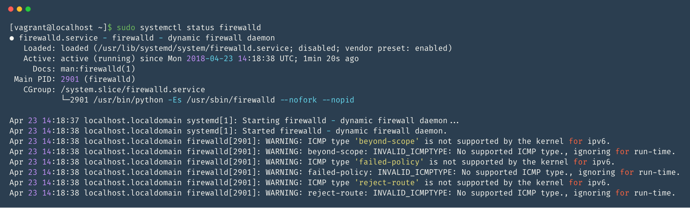
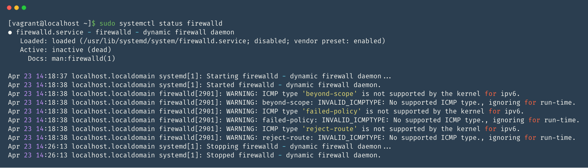

# CentOS7中firewalld防火墙的使用

### 简介

`firewalld`是 CentOS7 的一大特性，最大的好处是：1. 支持动态更新，不用重启服务 2. 加入了防火墙的“zone”概念。

`firewalld`的字符界面管理工具是 `firewall-cmd`。

zone概念： 硬件防火墙默认一般有三个区，firewalld引入这一概念，系统默认存在以下区域：

* `drop`：默认丢弃所有包
* `block`：拒绝所有外部连接，允许内部发起的连接
* `public`：指定外部连接可以进入
* `external`：这个不太明白，功能上和上面相同，允许指定的外部连接
* `dmz`：和硬件防火墙一样，受限制的公共连接可以进入
* `work`：工作区，概念和workgoup一样，也是指定的外部连接允许
* `home`：类似家庭组
* `internal`：信任所有连接

## firewalld管理命令

CentOS 7 和 Fedora 20+ 已经包含了 Firewalld，但是默认没有激活。

### 启动并在系统引导时启动该服务

```bash
sudo systemctl start firewalld
sudo systemctl enable firewalld
```

### 停止并禁用

```bash
sudo systemctl stop firewalld
sudo systemctl disable firewalld
```

### 查看状态

#### 简单查看

```bash
sudo firewall-cmd --state
```

> 输出应该是 `running` 或者 `not running`。

### 查看守护进程状态

```bash
sudo systemctl status firewalld
```






### 重新加载配置

```bash
sudo firewall-cmd --reload
```

## 配置

`firewalld`默认配置文件有两个。

1. `/usr/lib/firewalld/` 如默认区域和公用服务。在使用中尽量避免修改它们，因为每次 firewall 软件包在更新的时候都会覆盖这些文件。

2. `/etc/firewalld/` 保存系统配置文件。 这些文件中的配置将覆盖默认配置。

### 配置集

firewalld 使用两个配置集：**运行时**和**持久**。 在系统重新启动或重新启动 firewalld 时，不会保留运行时的配置更改，而对持久配置集的更改不会应用于正在运行的系统。

默认情况下，`firewall-cmd` 命令适用于运行时配置，但在执行命令的时候加上 `--permanent` 参数将保存到持久配置中。可以选择下面的方式之一进行持久化配置：

1. 将规则同时添加到持久规则集和运行时规则集中

```bash
sudo firewall-cmd --zone=public --add-service=http --permanent
sudo firewall-cmd --zone=public --add-service=http
```

2. 将规则添加到持久规则集中并重新加载 firewalld

```bash
sudo firewall-cmd --zone=public --add-service=http --permanent
sudo firewall-cmd --reload
```

> 使用`reload`命令重载配置的时候会删除所有运行时配置并应用永久配置。因为 firewalld 动态管理规则集，所以它不会破坏现有的连接和会话。

## CentOs7 开放端口

### 开放端口

```bash
firewall-cmd --zone=public --add-port=80/tcp --permanent
```

命令含义：

* `--zone` 作用域

* `--add-port=80/tcp` 添加端口，格式为：端口/通讯协议

* `--permanent` 永久生效，没加此参数重启 firewall 后修改的配置失效

### 允许或者拒绝任意端口/协议

```bash
sudo firewall-cmd --zone=public --add-port=12345/tcp --permanent
sudo firewall-cmd --zone=public --remove-port=12345/tcp --permanent
```

> 允许或者禁用 12345 端口的 TCP 流量

```bash
sudo firewall-cmd --zone=public --add-port=12345/udp --permanent
sudo firewall-cmd --zone=public --remove-port=12345/udp --permanent
```

> 允许或禁用 12345 端口的 UDP 流量。

### 查看端口的tcp协议是否被允许

```bash
sudo firewall-cmd --zone=public --query-port=8080/tcp
```

### 查看所有打开的端口

```bash
sudo firewall-cmd --zone=public --list-ports
```

### 屏蔽/解封IP

```bash
firewall-cmd  --add-rich-rule="rule family='ipv4' source address='114.114.114.114' reject"  # 临时屏蔽某个ip，重启失效
firewall-cmd  --add-rich-rule="rule family='ipv4' source address='114.114.114.114' reject"  --permanent # 永久屏蔽ip，重启依旧生效

firewall-cmd --remove-rich-rule="rule family='ipv4' source address='114.114.114.114' reject" # 永久删除屏蔽ip，重启失效

firewall-cmd --remove-rich-rule="rule family='ipv4' source address='114.114.114.114' reject"  --permanent # 永久删除屏蔽ip，重启依旧生效
```

## 参考地址

- [firewalld官方文档](https://access.redhat.com/documentation/zh-cn/red_hat_enterprise_linux/7/html/security_guide/sec-using_firewalls#sec-Introduction_to_firewalld)

- [CentOS 上的 FirewallD 简明指南](https://linux.cn/article-8098-1.html)

- [CentOS 7 下使用 FirewallD防火墙的配置与管理](http://blog.51cto.com/mrxiong2017/2084726)
