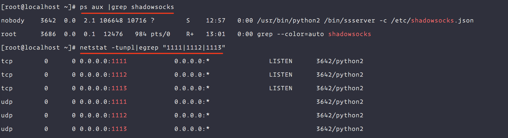

# CentOS7下安装配置 shadowsocks

[Shadowsocks](https://github.com/shadowsocks/)是当前比较受欢迎的科学上网工具，本文将介绍如何在 CentOS 7下安装和配置 Shadowsocks 服务。

> 如果需要科学上网，当前服务器必须不在墙内，否则无法达到预期效果。
> 本文只介绍了服务器安装Shadowsocks和简单配置。如果要在客户端正常使用可能还需要一些代理软件。比如：[Windows](https://github.com/shadowsocks/shadowsocks-windows/wiki/Shadowsocks-Windows-%E4%BD%BF%E7%94%A8%E8%AF%B4%E6%98%8E)、[MacOSX](https://github.com/shadowsocks/ShadowsocksX-NG)、[Android](https://github.com/shadowsocks/shadowsocks-android)、[IOS](https://github.com/shadowsocks/shadowsocks-iOS/wiki/Help)或者使用AppStore搜索`OpenWingy`这个软件。

## 安装

### 安装epel和pip

安装epel扩展源，并采用Python包管理工pip安装。

[pip](https://pip.pypa.io/en/stable/installing/)是 python 的包管理工具。在本文中将使用 python 版本的 shadowsocks，此版本的 shadowsocks 已发布到 pip
上，因此需要通过 pip 命令来安装。

```bash
sudo yum -y install epel-release
sudo yum -y install python-pip
```

### 安装Shadowsocks

在命令行运行下面的命令安装shadowsocks：

```bash
pip install --upgrade pip
pip install shadowsocks
```

## 配置

### 普通配置

安装完成后，需要创建配置文件`/etc/shadowsocks.json`，内容如下：

```json
{
  "server": "0.0.0.0",
  "server_port": 1111,
  "local_address": "127.0.0.1",
  "local_port": 1080,
  "password": "mypassword",
  "timeout": 300,
  "method": "aes-256-cfb",
  "fast_open": false
}
```

| 字段            | 说明                                                                                                                                     | 是否必须 |
|---------------|----------------------------------------------------------------------------------------------------------------------------------------|------|
| server        | 服务端监听地址，使用`0.0.0.0`也可以                                                                                                                 | 是    |
| server_port   | 服务端端口                                                                                                                                  | 是    |
| local_address | 本地监听地址,默认即可                                                                                                                            | 否    |
| local_port    | 本地监听端口，需要跟其他进程不重复                                                                                                                      | 否    |
| password      | 密码                                                                                                                                     | 是    |
| timeout       | 超时时间（秒）                                                                                                                                | 否    |
| method        | 加密方法，可选`aes-128-cfb`, `aes-192-cfb`, `aes-256-cfb`, `bf-cfb`, `cast5-cfb`, `des-cfb`, `rc4-md5`, `chacha20`, `salsa20`, `rc4`, `table` | 是    |
| fast_open     | 是否启用TCP-Fast-Open，true或者false                                                                                                          | 否    |

> 以上三项信息在配置 shadowsocks 客户端时需要配置一致，具体说明可查看 shadowsocks 的帮助文档。

### 配置多个用户

除了上面的配置，也可能使用多端口多密码配置，彼此没有干扰，内容如下：

```json
{
  "server": "0.0.0.0",
  "local_address": "127.0.0.1",
  "local_port": 1080,
  "port_password": {
    "1111": "password1",
    "1112": "password2",
    "1113": "password3"
  },
  "timeout": 300,
  "method": "aes-256-cfb",
  "fast_open": false
}
```

## 进程管理

* 启动进程

```bash
sudo ssserver -c /etc/shadowsocks.json -d start
```

* 关闭进程

```bash
sudo ssserver -c /etc/shadowsocks.json -d stop
```

* 重启进程

```bash
sudo ssserver -c /etc/shadowsocks.json -d restart
```

## 检查进程

分别使用`ps`和`netstat`命令查看进程和端口

```bash
sudo yum -y install net-tools
ps aux |grep shadowsocks
netstat -tunpl|grep 1111
```



## 使用Supervisord管理进程

如果未使用[Supervisord管理](/os/centos/how-to-use-supervisord-manager-processes.md)后台进程，可以参考文章下面的连接设置开机自启动等。

### 管理配置

针对shadowsocks的Supervisord的配置可以参考下面的配置。

```ini
[program:shadowsocks]
process_name = %(program_name)s_%(process_num)02d
command = ssserver -c /etc/shadowsocks.json
autostart = true
autorestart = true
user = nobody
numprocs = 1
redirect_stderr = true
stdout_logfile = /var/log/shdowsocks.out.log
stderr_logfile = /var/log/shdowsocks.err.log
```

### 重载配置

重载配置之前请先保证shadowsocks进程未启动。

```bash
sudo supervisorctl reread && sudo supervisorctl update
```

## 参考链接

- [在 CentOS 7 下安装配置 shadowsocks](https://morning.work/page/2015-12/install-shadowsocks-on-centos-7.html)

- [阿里云centos 7下搭建shadowsocks](https://segmentfault.com/a/1190000010639190)
