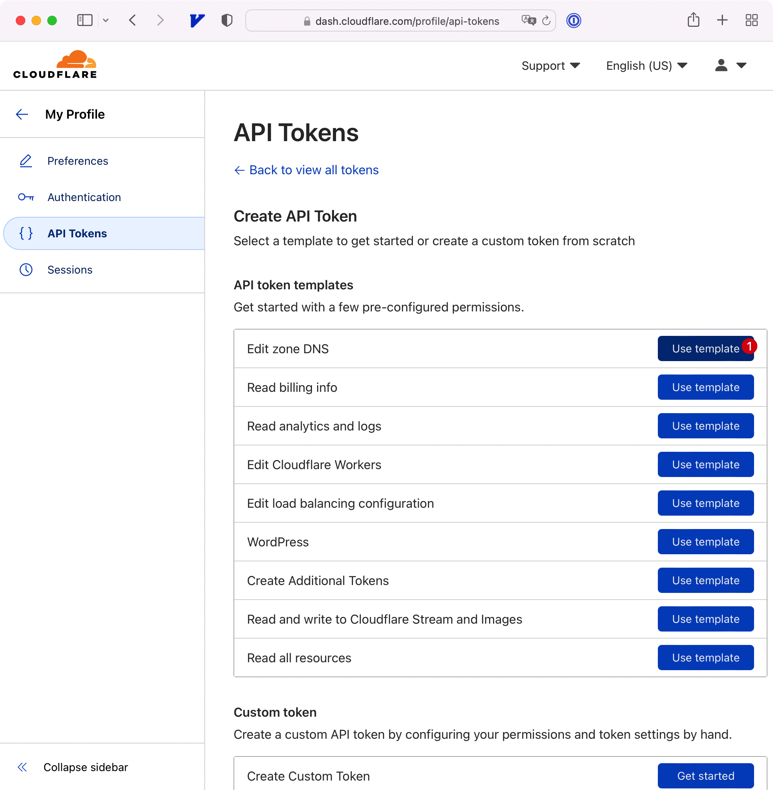
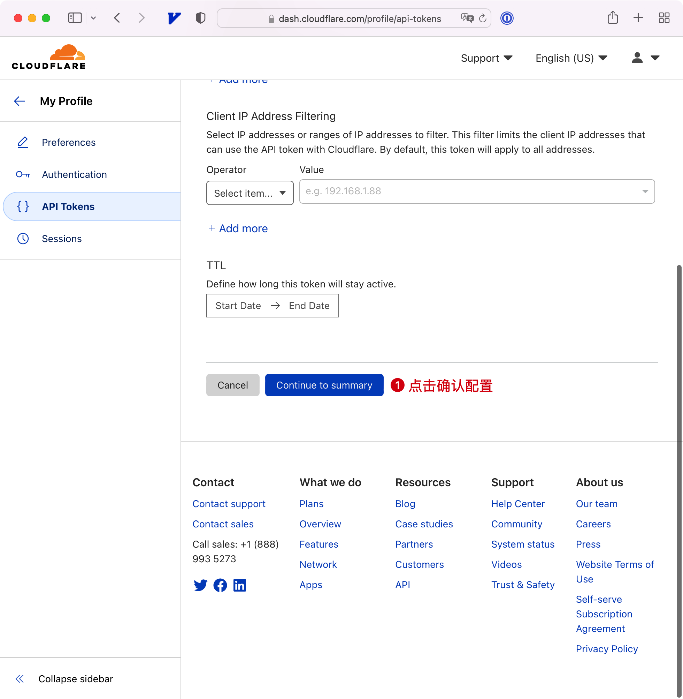
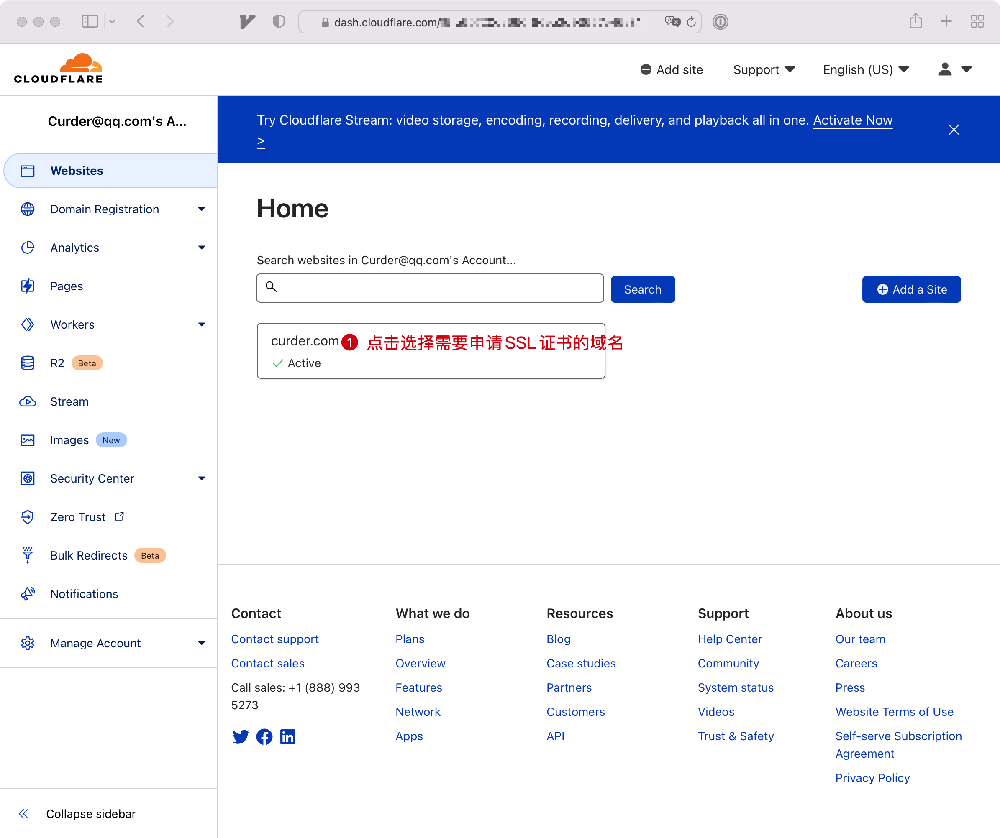
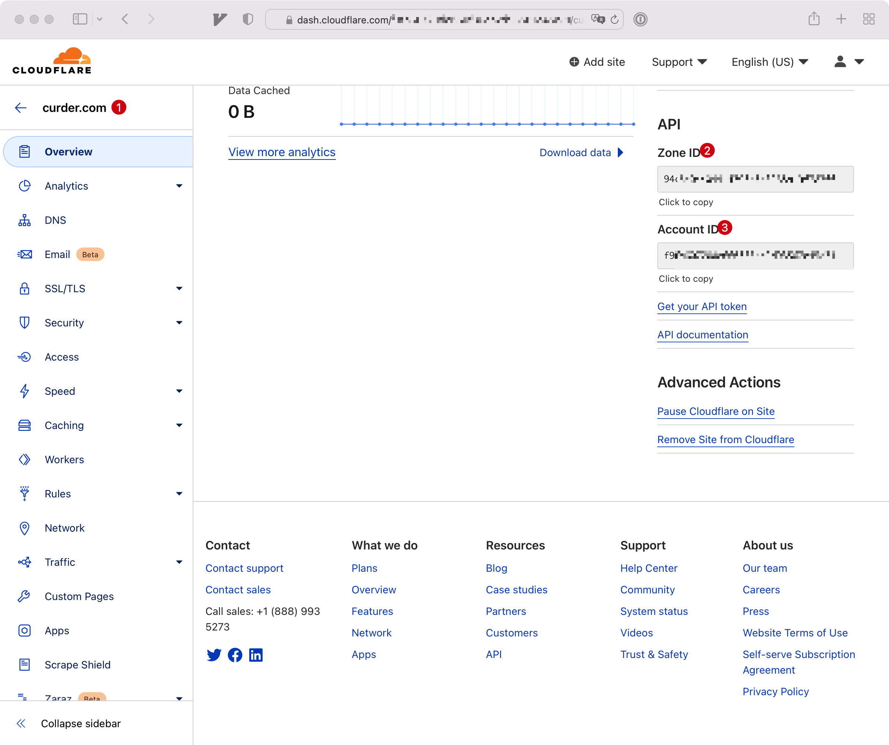

# 申请Let's Encrypt通配符HTTPS证书

通配符证书是一个SSL证书，可用于为给定域上的所有子域提供https，例如，`*.<domain>.com` 意味着任何子域名（如`www.example.com`或`links.example.com`）会使用相同的SSL证书。

使用通配符证书对于允许用户选择子域的应用程序非常有用，例如，`wordpress.com`子域下的所有博客。

[acme.sh](https://github.com/Neilpang/acme.sh) 实现了 `acme` 协议, 可以从 letsencrypt 生成免费的证书。

主要步骤:

0. 安装依赖
1. 安装 `acme.sh`
2. 生成证书
3. 拷贝安装证书到 `nginx/apache` 或者其他web服务器
4. 更新证书
5. 更新 acme.sh
6. 更改web服务器启用https

> 记得在操作具体的命令之前将一些域名变量`<domain>.com`替换成你当前要操作的域名信息。

## 安装依赖程序

* `Debian/Ubuntu`

  ```bash
  apt-get install curl -y && apt-get install cron -y && apt-get install socat -y
  ```

* `Centos`

  ```bash
  yum install curl -y && yum install cron -y && yum install socat -y
  ```

## 安装`acme.sh`

```bash
curl https://get.acme.sh | sh
```

::: details 输出如下内容

```bash
$ curl https://get.acme.sh | sh
% Total % Received % Xferd Average Speed Time Time Time Current
Dload Upload Total Spent Left Speed
100 705 100 705 0 0 2426 0 --:--:-- --:--:-- --:--:-- 2422
% Total % Received % Xferd Average Speed Time Time Time Current
Dload Upload Total Spent Left Speed
100 163k 100 163k 0 0 400k 0 --:--:-- --:--:-- --:--:-- 401k
[Sun Mar 18 20:11:01 CST 2018] Installing from online archive.
[Sun Mar 18 20:11:01 CST 2018] Downloading https://github.com/Neilpang/acme.sh/archive/master.tar.gz
[Sun Mar 18 20:11:03 CST 2018] Extracting master.tar.gz
[Sun Mar 18 20:11:03 CST 2018] It is recommended to install socat first.
[Sun Mar 18 20:11:03 CST 2018] We use socat for standalone server if you use standalone mode.
[Sun Mar 18 20:11:03 CST 2018] If you don't use standalone mode, just ignore this warning.
[Sun Mar 18 20:11:03 CST 2018] Installing to /root/.acme.sh
[Sun Mar 18 20:11:03 CST 2018] Installed to /root/.acme.sh/acme.sh
[Sun Mar 18 20:11:03 CST 2018] Installing alias to '/root/.bashrc'
[Sun Mar 18 20:11:03 CST 2018] OK, Close and reopen your terminal to start using acme.sh
[Sun Mar 18 20:11:03 CST 2018] Installing alias to '/root/.cshrc'
[Sun Mar 18 20:11:03 CST 2018] Installing alias to '/root/.tcshrc'
[Sun Mar 18 20:11:03 CST 2018] Installing cron job
[Sun Mar 18 20:11:03 CST 2018] Good, bash is found, so change the shebang to use bash as preferred.
[Sun Mar 18 20:11:03 CST 2018] OK
[Sun Mar 18 20:11:03 CST 2018] Install success!
```
:::

> 脚本会自动为当前用户创建定时任务, 每天凌晨自动检测所有的证书。**如果快过期了, 需要更新, 则会自动更新证书。**

**安装过程不会污染已有的系统任何功能和文件**, 所有的修改都限制在安装目录中: `~/.acme.sh/`

## 生成证书

`acme.sh` 实现了 **acme** 协议支持的所有验证协议. 一般有两种方式验证: `http` 和 `dns` 验证.

### http 验证

#### 通用方式

`http` 方式需要在你的网站根目录下放置一个文件, 来验证你的域名所有权,完成验证. 然后就可以生成证书了。

```bash
~/.acme.sh/acme.sh --issue -d <domain>.com -d www.<domain>.com --webroot /home/wwwroot/<domain>.com/
```

只需要指定域名, 并指定域名所在的网站根目录。 `acme.sh` 会全自动的生成验证文件, 并放到网站的根目录。然后自动完成验证，最后会聪明的删除验证文件，整个过程没有任何副作用。

#### Nginx

如果当前使用的是`nginx`服务器或者反代, `acme.sh` 还可以智能的从 `nginx`的配置中自动完成验证, 将不需要指定网站根目录:

```bash
~/.acme.sh/acme.sh --issue -d <domain>.com --nginx
```

#### Apache

如果你用的 `apache`服务器, `acme.sh` 还可以智能的从 `apache`的配置中自动完成验证, 你不需要指定网站根目录:

```bash
~/.acme.sh/acme.sh --issue -d <domain>.com --apache
```

> 注意：无论是 `apache` 还是 `nginx` 模式, `acme.sh`在完成验证之后, 会恢复到之前的状态, 都不会私自更改你本身的配置. 好处是你不用担心配置被搞坏, 也有一个缺点, 你需要自己配置 `ssl` 的配置, 否则只能成功生成证书, 你的网站还是无法访问`https`。

#### standalone

如果你还没有运行任何 web 服务, 80 端口是空闲的, 那么 acme.sh 还能假装自己是一个webserver, 临时听在80 端口, 完成验证:

```bash
~/.acme.sh/acme.sh --issue -d <domain>.com --standalone
```

> 以上命令都将ssl相关数据写入到文件地址`~/USER/.acme.sh/<domain>.com/`下，包含`ca.cer`、`<domain>.com.conf`、`<domain>.com.key`、`fullchain.cer`、`<domain>.com.csr`  
> 、`<domain>.com.cer`和`<domain>.com.csr.conf`。

### DNS验证

`dns` 方式, 在域名上添加一条 `txt` 解析记录, 验证域名所有权。

#### 阿里云 DNS

通过访问地址获取：[Ali_Key 和 Ali_Secret](https://ak-console.aliyun.com/#/accesskey)。  
然后输入下面命令。其中 `Ali_Key=""`中输入个人在阿里云后台的**Access Key ID**信息，`Ali_Secret=""`输入你的**Access Key Secret**信息。

```bash
export Ali_Key="soamdagfqweaf"
export Ali_Secret="asd213dfas"
```

接下来再输入下面命令申请`Let’s Encrypt`泛域名免费SSL证书。

```bash
~/.acme.sh/acme.sh --issue --dns dns_ali -d <domain>.com -d "*.<domain>.com"
```

第一次成功之后，`acme.sh`会记录下`App_Key`和`App_Secret`
，并且生成一个定时任务，每天凌晨0：00自动检测过期域名并且自动续期。对这种方式有顾虑的，请慎重，不过也可以自行删掉用户级的定时任务，并且清理掉`~/.acme.sh`文件夹就行。

#### CloudFlare DNS

CloudFlare的SSL证书申请需要 `CF_Token`、`CF_Account_ID` 和`CF_Zone_ID`，下面通过步骤一步一步演示这些数据的来源。

1. 登录到 Cloudflare 的 [API Tokens](https://dash.cloudflare.com/profile/api-tokens) 页面，点选如下图所示的『Create Token（建立Token）』。


2. 如下图所示在『Edit zone DNS（编辑区域DNS）』点选『Use template（使用模版）』來产生一個Token。


3. 如下图所示可以为这个 Token 命名一个辨识度高的名称，然后 Permissions（权限）区块，分别新增两个『Zone（区域）』，一個 Zone 选『Zone（区域）』仅允许『Read（读）』权限，另一个 Zone 选『DNS』仅允许『Edit（编辑）』权限；在 Zone Resources（区域资源）区块，新增一个『Include（包含）』，然后选择特定的 Zone『Specific zone（特定区域）』，最后就选择要申請SSL证书的域名。权限设定完成之后就点选『Continue to summary（继续至摘要）』。



4. 如下图所示可以再次确定你本次产生 API Token 的服务和权限是否正确，没有问题之后点击『Create Token（建立Token）』。


5. 可以看到已经生成了一组 API Token，**请注意此API密钥仅仅会显示一次**，如果后面没有的話，那仅能在 API Tokens 列表中点选需要重新产生的Token，及点选『Roll（翻新）』重新产生新的API密钥。如下图所示点击『Copy』按鈕將此API 密钥记录到需要使用的地方。


6. 回到 [Cloudflare 账户首页](https://dash.cloudflare.com)的『网站』页面选择本次要申請SSL证书的域名。



7. 如下图所示在域名『Overview（概览）』介面，鼠标滑动到最下面，可以在右侧看到API区域，在API区域中可以看到『Zone ID（区域识别码）』和『Account ID（账户识别码）』，分別点击『Click to copy（按一下即可复制）』。




8. 参考 acme.sh 提供的 dnsapi 文档的格式，在CLI上分别输入 API 密钥，比如以Cloudflare的DNS來說，就将刚刚上面取得的密钥分別填在对应的『CF_Token』、『CF_Account_ID』和『CF_Zone_ID』，就可以來申請SLL证书了。

```bash
export CF_Token="Orxxxxxxxxxxxxxxxxxxxxxxxxxxxxxxxxxxxxxx"
export CF_Zone_ID="94xxxxxxxxxxxxxxxxxxxxxxxxxxxxxx"
export CF_Account_ID="f9xxxxxxxxxxxxxxxxxxxxxxxxxxxxxx"

~/.acme.sh/acme.sh --issue --dns dns_cf -d "curder.com" -d "*.curder.com" \
--key-file       /etc/nginx/ssl/curder.com/privkey.pem  \
--fullchain-file /etc/nginx/ssl/curder.com/fullchain.pem \
--reloadcmd      "systemctl force-reload openresty.service"
# --reloadcmd      "service nginx force-reload"
```


## 拷贝安装证书

前面证书生成以后, 接下来需要使用命令把证书拷贝到真正需要用它的地方。

**注意, **默认生成的证书都放在安装目录下: `~/.acme.sh/`，不要直接使用此目录下的文件。例如: 不要直接让 `nginx/apache` 的配置文件使用这下面的文件. 这里面的文件都是内部使用, 而且目录结构可能会变化.

正确的使用方法是使用 `--installcert` 命令,并指定目标位置, 然后证书文件会被copy到相应的位置，如果 `/etc/nginx/ssl` 不存在需要使用`mkdir`
命令创建`mkdir -p /etc/nginx/ssl`， 例如:

```bash
~/.acme.sh/acme.sh --installcert -d <domain>.com \
--key-file /etc/nginx/ssl/<domain>.com.key \
--fullchain-file /etc/nginx/ssl/fullchain.cer \
--reloadcmd "service nginx force-reload"
```

Nginx 的配置 `ssl_certificate` 使用 `/etc/nginx/ssl/fullchain.cer` ，而非 `/etc/nginx/ssl/<domain>.cer` ，否则 SSL Labs 的测试会报 Chain
issues Incomplete 错误。

`--installcert` 命令可以携带很多参数, 来指定目标文件. 并且可以指定 `reloadcmd`, 当证书更新以后, `reloadcmd`会被自动调用,让服务器生效.

详细参数请参考: [https://github.com/Neilpang/acme.sh\#3-install-the-issued-cert-to-apachenginx-etc](https://github.com/Neilpang/acme.sh#3-install-the-issued-cert-to-apachenginx-etc)

值得注意的是, 这里指定的所有参数都会被自动记录下来, 并在将来证书自动更新以后, 被再次自动调用。

## 更新证书

目前证书在 60 天以后会自动更新, 无需任何操作. 今后有可能会缩短这个时间, 不过都是自动的, 作为使用者不用关心。

## 更新 acme.sh

目前由于 acme 协议和 letsencrypt CA 都在频繁的更新, 因此 `acme.sh` 也经常更新以保持同步

* 升级 acme.sh 到最新版

```bash
acme.sh --upgrade
```

* 如果你不想手动升级, 可以开启自动升级
  ```bash
  acme.sh --upgrade --auto-upgrade
  ```

之后, acme.sh 就会自动保持更新了.

* 你也可以随时关闭自动更新
  ```bash
  acme.sh --upgrade --auto-upgrade 0
  ```

## 更改web服务器启用https

这里以Nginx应用为例：

```nginx
server {
    listen      80; ## listen for ipv4
    server_name   <domain>.com;
    return      301 https://$server_name$request_uri;
}

server {
    charset utf-8;
    client_max_body_size 128M;

    listen 443;

    # SSL support
    ssl on;
    ssl_certificate      ../ssl/fullchain.cer;
    ssl_certificate_key  ../ssl/<domain>.com.key;

    server_name <domain>.com;
    root        /web_path/public;
    index       index.php;
}
```

更改完之后重启服务器`sudo systemctl reload nginx`，访问`<domain>.com`即可看到效果了。

> 如果你使用的是 aliyun 等云服务器，可能还需要配置云服务器的**安全组配置**，将 443 端口开放访问。

## 参考地址

* [Neilpang/acme.sh](https://github.com/Neilpang/acme.sh/wiki/说明)

* [申请Let's Encrypt通配符HTTPS证书](https://my.oschina.net/kimver/blog/1634575#comment-list)

* [使用阿里云域名API申请Let’s Encrypt泛域名免费SSL证书教程](https://www.wn789.com/15510.html)


