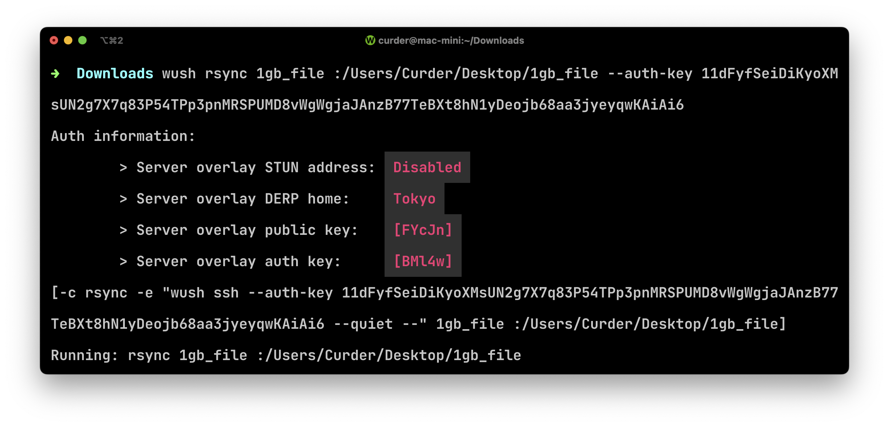

# 通过 wireguard 在计算机之间传输文件 wush

[wush](https://github.com/coder/wush) 是一个命令行工具，用于点对点连接轻松传输文件和打开 shell。

它有如下特点：

1. 无需设置或信任中继服务器进行身份验证。
2. 由 WireGuard 提供支持，实现安全、快速、可靠的连接。
3. 通过 UDP 实现自动点对点连接。
4. `cp`、`rsync`、`ssh`的支持。


## 安装
```bash
curl -fsSL https://raw.githubusercontent.com/coder/wush/main/install.sh | sh
```


## 基本用法

### 服务端

```bash
wush serve
```

下面是运行命令后得到的输出，当客户端需要连接服务端时，可通过 `<auth-key>` 连接。


### 客户端

#### 连接服务端 ssh

连接时使用的auth-key是服务端运行 `wush serve` 命令后得到的输出中的 `<auth-key>`。

```bash
wush ssh --auth-key <auth-key>
```


#### 同步文件 rsync

将文件或目录同步到目标地址。

```bash
wush rsync local-file.txt :/path/to/remote/file --auth-key <auth-key>
```




#### 拷贝文件 cp

连接时使用的auth-key是服务端运行 `wush serve` 命令后得到的输出中的 `<auth-key>`。

```bash
wush cp local-file.txt --auth-key <auth-key>
```


值得注意的是，拷贝到服务端的目标地址为 `wush serve` 启动时的路径。

