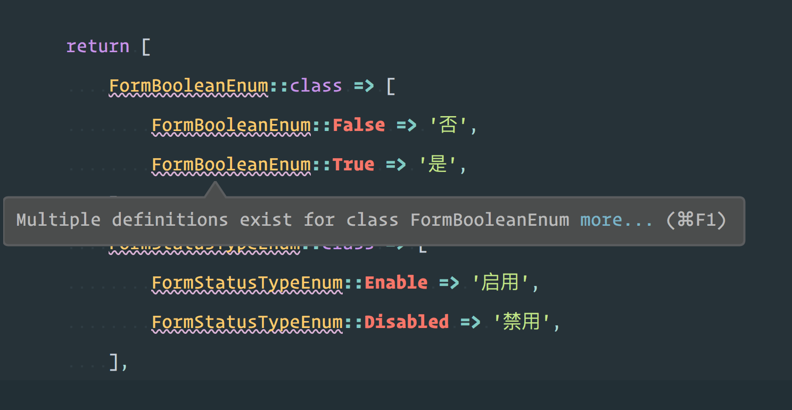

# phpstorm 提示 multiple definitions exist for class



按照下面的路径操作

```
Settings/Preferences | Editor | Inspections | PHP | Undefined | Undefined class | Don't report multiple class declaration potential problems
```


