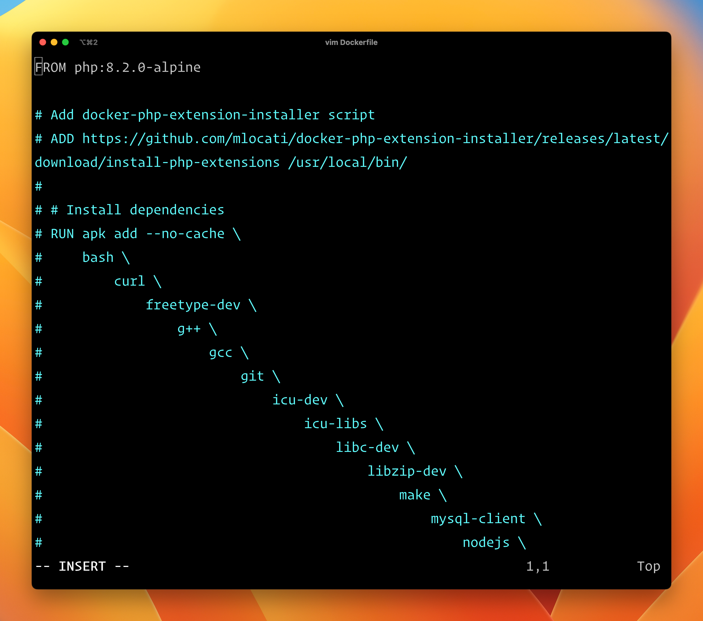

# vim 粘贴包含注释时不保留格式

使用 vim 编辑器在服务器上编辑配置文件时，经常会遇到粘贴的内容包含注释时出现格式错乱的情况。如下图：



这样粘贴的内容影响了阅读，也很容易造成错误。那么在 vim 中如何保持原格式粘贴呢？

## 方式一：使用 vi 粘贴

使用 vi 编辑器命令编辑内容，在粘贴时不会保留注释格式。

## 方式二：`:set paste`

在需要粘贴带有注释的文本时，输入模式下，输入 `:set paste` 指令，使粘贴的内容为纯文本。

粘贴完毕后，输入 `:set nopaste`，来取消自动缩进。

## 设置快捷键

可以在 `.vimrc` 中设置切换的快捷键，比如设置F9。

通过编辑 vim 的配置文件 `.vimrc` 中新增对应快捷键，一般情况下 vim 的配置文件可以通过 `vim --version` 命令的输出内容中查看到 `.vimrc` 文件所在位置。

比如这里修改当前用户的 `~/.vimrc` 文件，添加下面这行：

```
set pastetoggle=<F9>
```
 
添加配置之后，编辑文件时在插入模式按 `F9` 会在“-- 插入 --”模式和“-- 插入（粘贴） --”模式中切换。